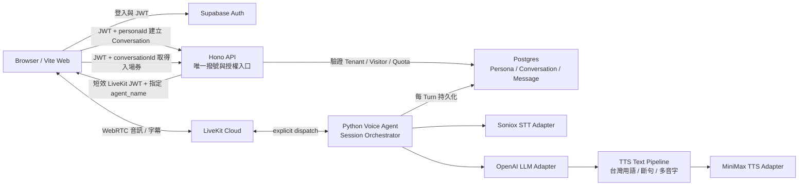

# 系統架構

## 1. 架構結論

建議採用「TypeScript Web/API + Python Voice Agent + Postgres」三個可獨立部署的 App，只把真正會被多個 TypeScript App 共用的資料格式放入 `packages/contracts`。

| 層級 | 正式方向 | 理由 | 目前狀態 |
|---|---|---|---|
| Web | Vite + React SPA | 前臺與 AI 主人後臺，不需要 SEO Server Rendering | 訪客註冊／登入、通話、逐字稿與 OWNER 後臺已建立；真實語音 E2E 待驗 |
| API | Hono + TypeScript | 統一 Auth、授權、Persona、Conversation、LiveKit Token 與容量閘門 | Conversation、OWNER CRUD、逐字稿、頭像、Token 與請求邊界已建立 |
| Voice Agent | Python + LiveKit Agents | Soniox、OpenAI、MiniMax 都在這裡執行即時管線 | Worker、三個 adapters、VAD、TTS 管線與 Core lifecycle 已建立；外部 E2E 待驗 |
| Database | Postgres | Persona 版本、Conversation Snapshot 與 Transcript 適合關聯式資料 | 6 個 migration 已在全新本機 Supabase 套用，並通過資料與跨帳號整合測試 |
| Auth | Supabase Auth | 不手刻密碼與 Session，支援課程帳號 | 本機註冊、登入、JWT、OWNER／VISITOR 隔離已驗；依產品決策不要求 Email 验證 |

Realtime Voice 不適合全部寫成 TypeScript：Coach Tracy 真實語音管線建立在 Python LiveKit Agents，而 Soniox 與 MiniMax TTS 已有實測過的 Python 經驗。為了單一語言硬改寫會增加時序與 SDK 風險。

## 2. 系統資料流



### 唯一撥號咽喉

`POST /voice/sessions/token` 是唯一可簽發 LiveKit Token 的入口。瀏覽器只能傳 `conversationId`，不能傳任意 `tenantId`、`voiceId`、`personaVersionId` 或 `agentName`。API 必須從已授權的 Conversation 與 PersonaVersion 取得這些值。

Token 簽發前依序檢查：

1. 總電源旗標。
2. 學生 Tenant 的剩餘秒數。
3. 該 Tenant 的同時通話上限。
4. 全系統同時通話上限。
5. 短時間新建通話速率。
6. Conversation 屬於當前訪客且尚未結束。

## 3. 正式目錄

```text
飛鷹課程_AI分身/
├── README.md
├── DEV_LOG.md
├── .env.example
├── package.json
├── pnpm-workspace.yaml
├── docs/
│   ├── ARCHITECTURE.md
│   ├── SOURCE_MAP.md
│   ├── EXTRACTION_DECISIONS.md
│   ├── MODULE_CONTRACTS.md
│   ├── SECURITY_AND_SECRETS.md
│   └── COURSE_ROADMAP.md
├── apps/
│   ├── web/
│   │   └── src/features/voice/
│   ├── api/
│   └── voice-agent/
│       ├── src/voice_agent/providers/
│       └── src/voice_agent/tts/
├── packages/
│   ├── contracts/
│   └── database/
├── infrastructure/
├── course/
└── tests/
```

### 為什麼沒有建立 `services/soniox` 與 `packages/persona`

| 原交接方向 | 正式決定 | 理由 |
|---|---|---|
| `services/soniox` / `services/openai` / `services/minimax` | 放在 `apps/voice-agent/src/voice_agent/providers/` | 這些供應商實作只由 Voice Agent 執行，不是共用 Package |
| `packages/persona` | 放在 `apps/api/src/modules/persona/` | Persona 業務邏輯目前只有 API 使用 |
| `packages/conversation` | 放在 `apps/api/src/modules/conversation/` | 同上，避免為單一呼叫者拆 Package |
| `packages/auth` | 放在 `apps/api/src/auth/` | Auth 不應讓瀏覽器與 Voice Agent 共用高權限邏輯 |
| `packages/ui` | 先不建立 | 目前只有一個 Web App，沒有第二個 UI 消費者 |
| `packages/contracts` | 保留 | Web 與 API 需共用 request / response 格式 |
| `packages/database` | 保留 | Database schema、migration 與 RLS 需有單一所有者 |

## 4. 第一版資料模型

| 模型 | 必要關聯與快照 |
|---|---|
| Tenant | 對應一位學生，是配額、Voice ID 與資料隔離邊界 |
| User | Auth User，角色為 OWNER 或 VISITOR，權限不存在可由使用者自改的 metadata |
| TenantMembership | 將 User 綁到 Tenant 與角色 |
| Persona | 穩定的角色 ID、名稱、介紹、發布狀態與當前版本 |
| PersonaVersion | 不可變的 System Prompt、開場白與 Voice Snapshot |
| Conversation | 訪客、PersonaVersion、開始/結束時間、摘要、Prompt Snapshot、Voice Snapshot |
| Message | Conversation、Turn ID、Sequence、USER/ASSISTANT、原始繁中文字稿 |
| UsagePolicy | Tenant 可用秒數、同時通話數、速率與停用狀態 |

Persona 每次修改都新增 PersonaVersion，不覆蓋舊版。Conversation 建立時同時保留 `personaVersionId` 與文字 Snapshot，即使後來版本資料遺失，舊對話仍可還原當時人格。

## 5. 獨立部署的容量驗證

正式課程不建立一個供 30 位學員共用的 runtime。每位學員都有自己的 Web、Core、Voice Agent、Supabase 與 Provider Key，因此中央式 30 通壓測不是發課前關卡。

每套學員系統仍必須通過以下可控驗證：

1. 完成一通從註冊、建立 Conversation、STT、LLM、TTS 到後臺逐字稿的真實 E2E。
2. 驗證該套設定的同時通話上限會拒絕超額請求，不會 fail-open。
3. 記錄單通的 STT Final、LLM First Token、TTS First Audio 與掛斷存檔結果。
4. 檢查每位學員的 Key、資料庫與帳號不會共用或串接到別人系統。

若未來改成中央共用 runtime，那是新架構；屆時才需重新設計租戶容量、Provider 配額與階梯壓測，不可沿用本次獨立部署的結論。

## 6. 第一版記憶邊界

第一版只保留：原始 Message、單次 Conversation Summary，以及後續可選的訪客基本側寫。不搬向量記憶、知識圖譜、承諾追蹤、背景 Job 群或新舊雙資料庫。

## 7. TTS 文字與逐字稿分流

LLM 原始內容會分成兩條：

1. Transcript／Message：保存台灣正體、可供使用者閱讀的文字。
2. TTS reading script：加入數字念法、多音字提示與 MiniMax 保守字形，只供合成音訊。

兩條不能互相覆寫。朗讀稿裡的同音替代字是「演員的注音提示」，不是正式台詞。

## 8. 已確認的部署決策

| 決策 | 正式做法 | 影響 |
|---|---|---|
| Provider Key | 老師分別提供每位學員專屬 Key | 不建共用 Course Token Gateway；Key 只寫入學員自己的環境變數 |
| Runtime | 每位學員獨立部署 Web／Core／Voice | 一位學員的異常不會變成全班共用 runtime 的容量問題 |
| 資料服務 | 每位學員獨立 Supabase Postgres／Auth／Storage | 帳號與對話不在全班共用資料庫 |
| 註冊確認 | 允許 Email／密碼註冊，不要求 Email 驗證 | 這是課程產品簡化決策，不宣稱等同高安全會員系統 |

契約仍保留 `tenantId`、RLS、admission 與 rate limit，因為這些也保護單一學員系統內的 OWNER／VISITOR 邊界與 API 成本。

## 9. 課程發佈與學生組裝

目前 monorepo 是老師端唯一真實來源，不直接交給學生修改。發課時由 `course/tools/course_kits.py` 產生三個同版本 repository-ready 資料夾：

1. Web Kit：`apps/web`。
2. Core Kit：`apps/api`、contracts、database、架構文件、組裝器與根目錄設定。
3. Voice Kit：`apps/voice-agent`。

學生 clone 三包後，組裝器建立第四個乾淨專案；不使用 Git submodule，也不帶入三包的 `.git`。完整安全與版本規則見 `docs/MULTI_REPO_DISTRIBUTION.md`。
